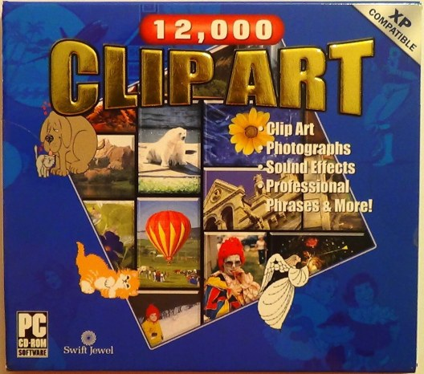
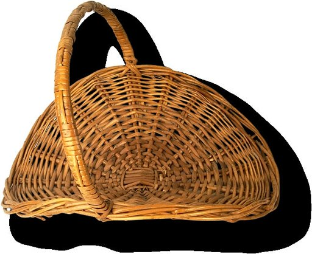
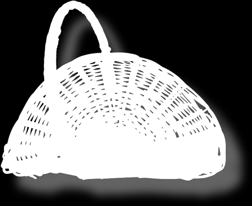
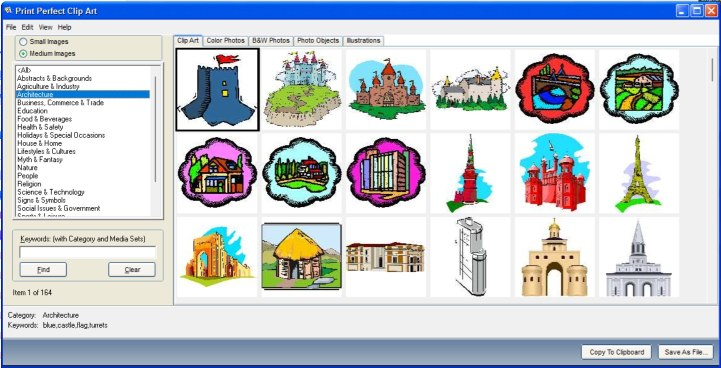

# Esoteric Picture Extractor

This .NET 8 solution leverages [magic bytes](https://en.wikipedia.org/wiki/List_of_file_signatures) to decompose large, concatenated binary files into individual components.

The following formats are currently supported:
* BZ2
* EMF
* GZIP
* JFIF (JPG)
* PNG
* WMF
* HPI

## To Use

The command-line application must be executed with three parameters:

1. Source file path
  * e.g., `C:\foo.dat`
2. Destination folder path
  * e.g, `C:\exportContents`
3. Mode
  * e.g., `ALL`, `WMF`, `GZIP`, `HPI`, `JFIF`, `PNG`, `BZ2`, or `JP2`

A sample data file named `combinedFiles.dat` is located within the `testFiles` folder. It is made up by concatenating numerous files together, which are also available for review reference. Running the application against the sample data file will decompose it back into individual files.

## Technology Stack

The solution is written with:
* .NET 8
* Magick.Net (only for processing HPI files in a fast manner)

## Background

Before Internet access became ubiquitous, people could only access a small selection of clip-art when creating documents and presentations. Options were typically limited to what came included with installed office productivity software. However, it was possible to buy clip-art collections on floppy disks and CDs like the one shown below.

Given that computers had limited computing power and storage space during this time period, these clip-art libraries consisted of small-sized vector images in [WMF and EMF formats](https://en.wikipedia.org/wiki/Windows_Metafile). Users could just copy these files directly from the disk onto their local computer for later use.

As time went on, some clip-art collections required users to install proprietary software to browse, access, and use the clip-art. Frequently written with Windows 3.1 in mind, this proprietary software will have compatibility problems with modern systems. In addition, these clip-art collections started including graphics in common formats like BMP, JPG, PNG or esoteric formats like HPI. 

### What is HPI?

HPI is a proprietary image format created by Hemera Technologies and used extensively within the `Photo Clip Art 10,000` clip-art collection. As a proprietary format, users had to install software to browse and export HPI-formatted images for use in other applications *one-at-a-time*.

Rather than installing such software, I opened up an HPI file in a binary viewer to discover that the format is just a container for one JPG file and one PNG file. The JPG file contains RGB data whereas the PNG file is a grayscale image used as an alpha channel. Not only does HPI combine the strengths of both formats (JPG compression, PNG transparency), it locks the image in a proprietary format that most users would not be able to bypass.

### Proprietary Software

The `12,000 Clip Art` collection by COSMI requires users to install proprietary software to access clip-art. Users can only export images one-at-a-time.

The software installs several large (100MB+) files. These files are named like `Vector0_CNT.dat` and `Raster0_CNT.dat`, suggesting that they contain clip-art data. This was confirmed by viewing the files in a binary viewer, showing that each file was the combination of hundreds of smaller files.

### Why This Software Exists

It is *expensive* to license photos from modern sites like [Pond5.com](https://www.pond5.com). Alternatively, the dated clip-art and photos in these collections are *royalty-free* and thus can be used with minimal restrictions for personal and professional projects. 

You don't need a modern photograph of a *entrega de equipaje* to create a flashcard for studying Spanish words! 

## License

The source code contained in this repository is [licensed under CC0](./LICENSE). However, this license *does not apply to any media files*.

* Stock photo(s) from `Art Explosion 500,000` by Nova Development under their end-user license agreement. All rights reserved.
* Stock photo(s) from `Photo Clip Art 10,000` by IdeaSoft under their royalty-free license. All rights reserved.
* Stock photo(s) from `12,000 Clip Art #1` by Cosmi.  2005 Cosmi Corporation, and its licensors. All rights reserved.